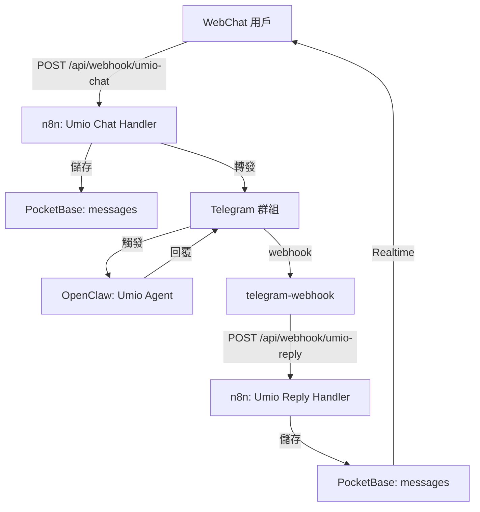

# Umio WebChat 整合指南

**日期**: 2026-03-14  
**版本**: 1.0  
**架構**: n8n Webhook → Telegram → OpenClaw Umio → n8n → PocketBase

---

## 架構流程



---

## 一、n8n Workflow 設定

### Workflow 1: WebChat Umio Integration

**Webhook URL**: `https://www.neovega.cc/api/webhook/umio-chat`

**檔案**: `n8n/webchat-umio-integration-workflow.json`

**流程**:
1. 接收 WebChat POST 請求
2. 同時執行：
   - 儲存用戶訊息到 PocketBase
   - 轉發訊息到 Telegram 群組（觸發 Umio）
3. 回傳成功響應

**匯入方式**:
```bash
# 在 n8n 介面中
1. Workflows → Import from File
2. 選擇 webchat-umio-integration-workflow.json
3. 設定 Telegram Credential
4. Activate
```

---

### Workflow 2: Umio Reply Handler

**Webhook URL**: `https://www.neovega.cc/api/webhook/umio-reply`

**檔案**: `n8n/umio-reply-handler-workflow.json`

**流程**:
1. 接收來自 telegram-webhook 的回覆
2. 檢查是否有 sessionId
3. 儲存 Umio 回覆到 PocketBase
4. 回傳儲存結果

**匯入方式**:
```bash
# 同上，選擇 umio-reply-handler-workflow.json
```

---

## 二、Nginx 配置

在 `nginx.conf` 中添加：

```nginx
# n8n Umio Webhook 代理
location /api/webhook/ {
    set $n8n n8n.zeabur.internal:5678;
    proxy_pass http://$n8n/webhook/;
    proxy_set_header Host $host;
    proxy_set_header X-Real-IP $remote_addr;
    proxy_set_header X-Forwarded-For $proxy_add_x_forwarded_for;
    proxy_set_header X-Forwarded-Proto $scheme;
    proxy_set_header Content-Type application/json;
}
```

**部署後重啟 Nginx**。

---

## 三、telegram-webhook 修改

修改 `telegram-webhook/src/index.ts`，在偵測到 Umio 回覆時轉發到 n8n：

```typescript
// 在處理 OpenClaw 回覆的函數中
async function handleOpenClawReply(message: any, sessionId: string) {
    // ... 現有代碼 ...

    // 轉發到 n8n
    await fetch('https://www.neovega.cc/api/webhook/umio-reply', {
        method: 'POST',
        headers: { 'Content-Type': 'application/json' },
        body: JSON.stringify({
            sessionId,
            replyText: message.text,
            agentName: 'umio',
            timestamp: new Date().toISOString()
        })
    });
}
```

---

## 四、前端修改

修改 `src/services/umioChat.ts`（或新建）：

```typescript
export async function sendMessageToUmio(
    message: string,
    sessionId: string
): Promise<{ success: boolean; message: string }> {
    const response = await fetch('/api/webhook/umio-chat', {
        method: 'POST',
        headers: { 'Content-Type': 'application/json' },
        body: JSON.stringify({
            message,
            sessionId,
            platform: 'webchat'
        })
    });

    if (!response.ok) {
        throw new Error(`HTTP error! status: ${response.status}`);
    }

    return await response.json();
}
```

---

## 五、測試步驟

### Step 1: 測試 WebChat → Umio

```bash
curl -X POST https://www.neovega.cc/api/webhook/umio-chat \
  -H "Content-Type: application/json" \
  -d '{
    "message": "你好 Umio",
    "sessionId": "test-umio-001",
    "platform": "webchat"
  }'
```

**預期結果**:
- ✅ HTTP 200
- ✅ 訊息出現在 Telegram 群組
- ✅ Umio 回覆 Telegram 訊息

### Step 2: 測試 Umio 回覆 → WebChat

```bash
curl -X POST https://www.neovega.cc/api/webhook/umio-reply \
  -H "Content-Type: application/json" \
  -d '{
    "sessionId": "test-umio-001",
    "replyText": "你好！我是 Umio",
    "agentName": "umio"
  }'
```

**預期結果**:
- ✅ HTTP 200 `{ "stored": true }`
- ✅ 訊息存入 PocketBase
- ✅ WebChat UI 顯示回覆

---

## 六、環境變數

| 服務 | 變數 | 值 |
|------|------|-----|
| n8n | `TELEGRAM_BOT_TOKEN` | Telegram Bot API Token |
| telegram-webhook | `N8N_WEBHOOK_URL` | `https://www.neovega.cc/api/webhook` |

---

## 七、故障排除

### 問題: Webhook 404

**檢查**:
```bash
curl https://www.neovega.cc/api/webhook/umio-chat -v
```

**解決**: 確認 nginx.conf 已更新並重啟 Nginx

### 問題: Telegram 訊息未發送

**檢查**:
1. n8n 中 Telegram Credential 是否正確設定
2. Workflow 是否已 Activate

### 問題: Umio 未回覆

**檢查**:
1. Telegram 群組中是否正確標記了 `@neovegaandrea_bot`
2. OpenClaw 是否正常運作

### 問題: 回覆未顯示在 WebChat

**檢查**:
1. telegram-webhook 是否正確轉發到 n8n
2. PocketBase Realtime 訂閱是否正常

---

## 八、檔案清單

```
n8n/
├── webchat-umio-integration-workflow.json   # 用戶訊息處理
├── umio-reply-handler-workflow.json         # Umio 回覆處理
telegram-webhook/
└── src/index.ts                             # 需修改：添加 n8n 轉發
nginx.conf                                   # 需修改：添加 webhook 路由
src/services/umioChat.ts                     # 新建或修改：前端 API
```

---

**最後更新**: 2026-03-14 17:30 (UTC+8)
